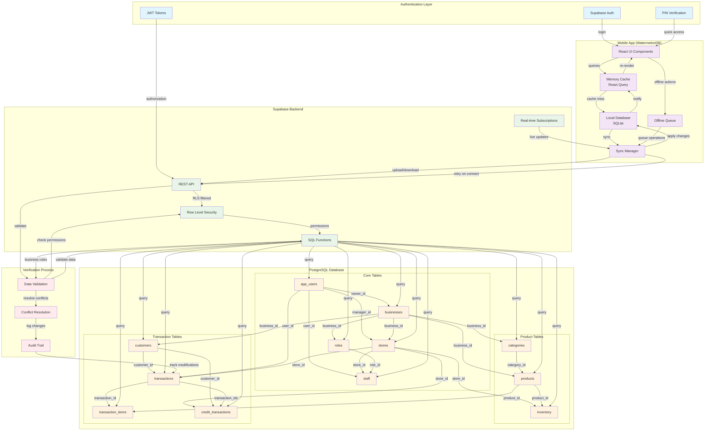
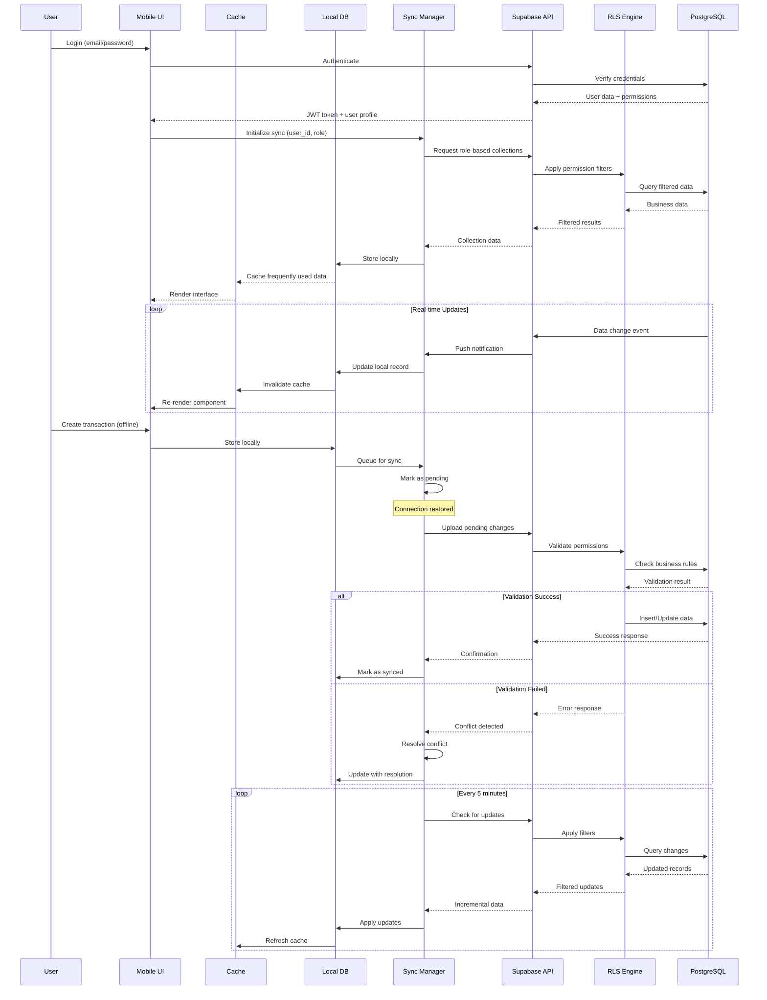
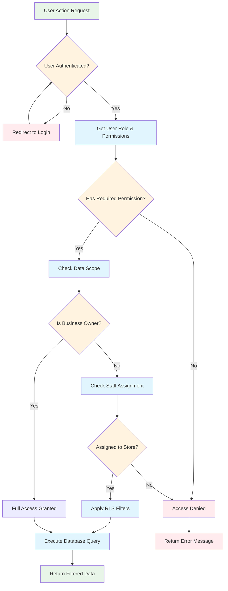
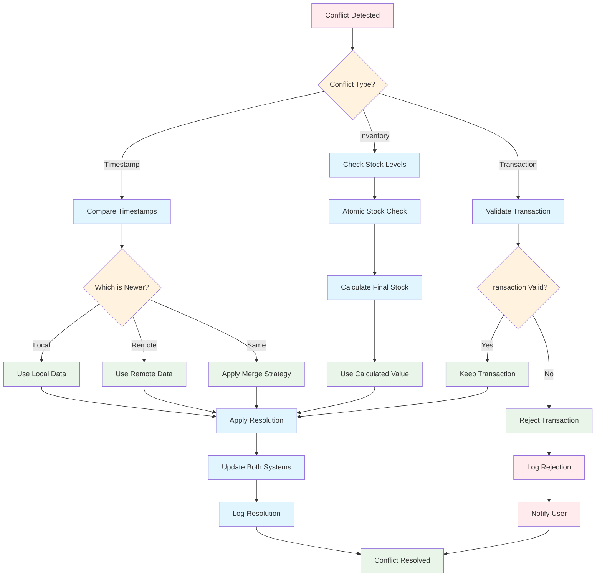
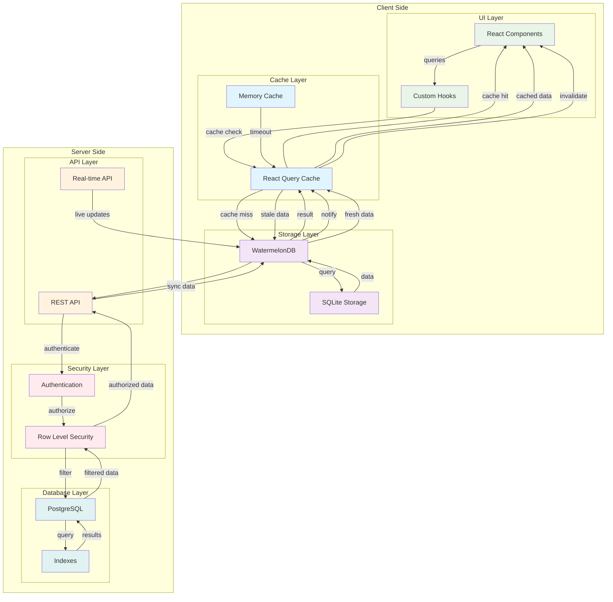

# POS System Database Architecture

## Overview

This document describes the comprehensive database architecture for a multi-tenant Point of Sale (POS) system designed to work both online and offline. The system uses **Supabase PostgreSQL** as the primary database with **WatermelonDB** for local offline storage and synchronization.

## Table of Contents

1. [Architecture Overview](#architecture-overview)
2. [Database Schema Design](#database-schema-design)
3. [Data Relationships](#data-relationships)
4. [Role-Based Access Control (RBAC)](#role-based-access-control-rbac)
5. [Offline-First Strategy](#offline-first-strategy)
6. [Synchronization Strategy](#synchronization-strategy)
7. [Caching Design](#caching-design)
8. [Implementation Guidelines](#implementation-guidelines)
9. [Security Considerations](#security-considerations)

## Architecture Overview

### System Components

```
┌─────────────────┐    ┌──────────────────┐    ┌─────────────────┐
│   Mobile App    │    │   Supabase API   │    │   PostgreSQL    │
│  (WatermelonDB) │◄──►│   (Real-time)    │◄──►│   (Primary DB)  │
└─────────────────┘    └──────────────────┘    └─────────────────┘
         │                       │
         │                       │
         ▼                       ▼
┌─────────────────┐    ┌──────────────────┐
│  Local Storage  │    │   Row Level      │
│  (SQLite)       │    │   Security       │
└─────────────────┘    └──────────────────┘
```

### Key Design Principles

1. **Multi-tenancy**: Each business operates independently
2. **Role-based permissions**: Granular access control per user role
3. **Offline-first**: Full functionality without internet connection
4. **Eventual consistency**: Data syncs when connection is restored
5. **Scalable**: Supports multiple stores per business

## Database Schema Design

### Core Tables

#### 1. `app_users`
**Purpose**: User profiles linked to Supabase auth
```sql
app_users (
  id uuid PRIMARY KEY,           -- References auth.users(id)
  external_id text UNIQUE,       -- For data migration (e.g., "user_001")
  email text UNIQUE,
  name text,
  phone text,
  pin_hash text,                 -- Hashed PIN for quick access
  created_at timestamptz
)
```

#### 2. `businesses`
**Purpose**: Top-level business entities
```sql
businesses (
  id uuid PRIMARY KEY,
  external_id text UNIQUE,       -- For data migration (e.g., "biz_001")
  name text NOT NULL,
  owner_id uuid REFERENCES app_users(id),
  created_at timestamptz,
  updated_at timestamptz
)
```

#### 3. `stores`
**Purpose**: Physical locations within a business
```sql
stores (
  id uuid PRIMARY KEY,
  external_id text UNIQUE,       -- For data migration (e.g., "store_001")
  business_id uuid REFERENCES businesses(id),
  name text NOT NULL,
  address text,
  phone text,
  email text,
  manager_id uuid REFERENCES app_users(id),
  status text DEFAULT 'active',
  currency text DEFAULT 'KES',
  created_at timestamptz,
  updated_at timestamptz
)
```

#### 4. `roles`
**Purpose**: Permission definitions per business
```sql
roles (
  id uuid PRIMARY KEY,
  external_id text UNIQUE,       -- For data migration (e.g., "role_001")
  business_id uuid REFERENCES businesses(id),
  name text NOT NULL,
  permissions jsonb DEFAULT '{}', -- Flexible permission system
  UNIQUE(business_id, name)
)
```

**Permission Structure**:
```json
{
  "checkout": true,
  "credit": true,
  "inventory": true,
  "insights": true,
  "user_management": true,
  "store_management": true,
  "settings": true
}
```

#### 5. `staff`
**Purpose**: User assignments to stores with specific roles
```sql
staff (
  id uuid PRIMARY KEY,
  external_id text UNIQUE,       -- For data migration (e.g., "usr_001")
  user_id uuid REFERENCES app_users(id),
  store_id uuid REFERENCES stores(id),
  role_id uuid REFERENCES roles(id),
  assigned_at timestamptz,
  UNIQUE(user_id, store_id)      -- One role per store per user
)
```

### Product Management Tables

#### 6. `categories`
**Purpose**: Product categorization per business
```sql
categories (
  id uuid PRIMARY KEY,
  external_id text UNIQUE,       -- For data migration (e.g., "cat_001")
  business_id uuid REFERENCES businesses(id),
  name text NOT NULL,
  icon text,                     -- Emoji or icon identifier
  color text,                    -- Hex color code
  created_at timestamptz,
  UNIQUE(business_id, name)
)
```

#### 7. `products`
**Purpose**: Product catalog per business
```sql
products (
  id uuid PRIMARY KEY,
  external_id text UNIQUE,       -- For data migration (e.g., "BEV001")
  business_id uuid REFERENCES businesses(id),
  category_id uuid REFERENCES categories(id),
  name text NOT NULL,
  cost numeric(12,2) DEFAULT 0,  -- Cost price
  barcode text,
  description text,
  unit text,                     -- "bottle", "kg", "piece", etc.
  status text DEFAULT 'active',
  created_at timestamptz,
  updated_at timestamptz,
  UNIQUE(business_id, barcode)
)
```

#### 8. `inventory`
**Purpose**: Stock levels per store per product
```sql
inventory (
  id uuid PRIMARY KEY,
  external_id text UNIQUE,       -- For data migration (e.g., "inv_001")
  product_id uuid REFERENCES products(id),
  store_id uuid REFERENCES stores(id),
  quantity integer DEFAULT 0,
  min_stock integer DEFAULT 0,
  max_stock integer DEFAULT 0,
  price numeric(12,2) DEFAULT 0, -- Selling price
  whole_sale_price numeric(12,2) DEFAULT 0,
  location text,                 -- Physical location in store
  last_updated timestamptz,
  UNIQUE(store_id, product_id)   -- One inventory record per store per product
)
```

### Transaction Tables

#### 9. `customers`
**Purpose**: Customer records per business
```sql
customers (
  id uuid PRIMARY KEY,
  external_id text UNIQUE,       -- For data migration (e.g., "cust_001")
  business_id uuid REFERENCES businesses(id),
  name text NOT NULL,
  phone text,
  email text,
  credit_limit numeric(14,2) DEFAULT 0,
  current_balance numeric(14,2) DEFAULT 0,
  reputation_score numeric(4,1), -- 0-10 scale
  created_at timestamptz,
  updated_at timestamptz,
  UNIQUE(business_id, phone)     -- Unique phone per business
)
```

#### 10. `transactions`
**Purpose**: Sales transactions
```sql
transactions (
  id uuid PRIMARY KEY,
  external_id text UNIQUE,       -- For data migration (e.g., "txn_001")
  store_id uuid REFERENCES stores(id),
  user_id uuid REFERENCES app_users(id),
  customer_id uuid REFERENCES customers(id),
  total_amount numeric(14,2) NOT NULL,
  discount_amount numeric(14,2) DEFAULT 0,
  subtotal numeric(14,2) NOT NULL,
  payment_method text NOT NULL,  -- 'cash', 'mpesa', 'card', etc.
  status text DEFAULT 'completed',
  created_at timestamptz,
  updated_at timestamptz
)
```

#### 11. `transaction_items`
**Purpose**: Individual items within a transaction
```sql
transaction_items (
  id uuid PRIMARY KEY,
  external_id text UNIQUE,       -- For data migration (e.g., "txi_001")
  transaction_id uuid REFERENCES transactions(id),
  product_id uuid REFERENCES products(id),
  quantity integer NOT NULL,
  unit_price numeric(12,2) NOT NULL,
  total_price numeric(14,2) NOT NULL
)
```

#### 12. `credit_transactions`
**Purpose**: Credit sales and payments
```sql
credit_transactions (
  id uuid PRIMARY KEY,
  external_id text UNIQUE,       -- For data migration (e.g., "cr_001")
  customer_id uuid REFERENCES customers(id),
  store_id uuid REFERENCES stores(id),
  transaction_ids uuid[] DEFAULT '{}', -- Array of transaction IDs
  type text NOT NULL CHECK (type IN ('credit_sale', 'payment')),
  amount numeric(14,2) NOT NULL,
  balance_after numeric(14,2) NOT NULL,
  description text,
  created_at timestamptz
)
```

## Data Relationships

### Entity Relationship Diagram

```
app_users (1) ──┐
                │
                ├── (1) businesses (1) ── (N) stores
                |        │            │
                │        │            └── (N) stores
                │        │
                │        │
                │        └── (1) ── (N) roles
                │        │
                │        ├── (1) ── (N) categories
                │        │
                │        ├── (1) ── (N) products
                │        │
                │        └── (1) ── (N) customers
                │
                └── (N) staff (N) ── (1) stores
                         │
                         └── (1) roles

stores (1) ── (N) inventory (N) ── (1) products
stores (1) ── (N) transactions (N) ── (1) app_users
stores (1) ── (N) credit_transactions (N) ── (1) customers

transactions (1) ── (N) transaction_items (N) ── (1) products
```

### Key Relationships

1. **Business Hierarchy**:
   - `businesses` → `stores` (1:N)
   - `businesses` → `roles` (1:N)
   - `businesses` → `categories` (1:N)
   - `businesses` → `products` (1:N)
   - `businesses` → `customers` (1:N)

2. **User Management**:
   - `app_users` → `businesses` (1:N, as owner)
   - `app_users` → `staff` (1:N)
   - `staff` → `stores` (N:1)
   - `staff` → `roles` (N:1)

3. **Product Management**:
   - `products` → `categories` (N:1)
   - `products` → `inventory` (1:N)
   - `stores` → `inventory` (1:N)

4. **Transaction Flow**:
   - `stores` → `transactions` (1:N)
   - `app_users` → `transactions` (1:N)
   - `customers` → `transactions` (1:N)
   - `transactions` → `transaction_items` (1:N)
   - `products` → `transaction_items` (1:N)

## Role-Based Access Control (RBAC)

### Permission System

The system uses a flexible JSON-based permission system stored in the `roles.permissions` field:

```typescript
interface RolePermissions {
  checkout: boolean;        // Process sales transactions
  credit: boolean;          // Manage credit sales and payments
  inventory: boolean;       // Manage products and stock
  insights: boolean;        // View reports and analytics
  user_management: boolean; // Manage users and roles
  store_management: boolean; // Manage stores and settings
  settings: boolean;        // Access business settings
}
```

### Default Roles

#### 1. Owner
- **Permissions**: All permissions enabled
- **Scope**: Full access to all business data
- **Use Case**: Business owner with complete control

#### 2. Store Manager
- **Permissions**: `checkout`, `credit`, `inventory`, `insights`
- **Scope**: Store-level operations, no user management
- **Use Case**: Store supervisor managing daily operations

#### 3. Cashier
- **Permissions**: `checkout`, `credit`
- **Scope**: Transaction processing only
- **Use Case**: Point-of-sale operator

#### 4. Inventory Manager
- **Permissions**: `inventory`, `insights`
- **Scope**: Product and stock management
- **Use Case**: Stock management specialist

### Row Level Security (RLS)

Supabase implements RLS policies to enforce permissions:

```sql
-- Example: Inventory access based on store permissions
CREATE POLICY inventory_read ON inventory
FOR SELECT USING (
  has_store_permission(auth.uid(), store_id, 'inventory')
  OR has_store_permission(auth.uid(), store_id, 'checkout')
  OR is_business_owner(auth.uid(), store_business_id(store_id))
);
```

## Offline-First Strategy

### WatermelonDB Schema

The local database mirrors the Supabase schema with some modifications for offline functionality:

#### Key Differences

1. **External ID Mapping**: Uses `external_id` fields to map between local and remote records
2. **Simplified Relationships**: Uses string references instead of UUIDs for easier sync
3. **JSON Storage**: Complex data stored as JSON strings (e.g., `permissions_json`)

#### Schema Structure

```javascript
// Example: Business table in WatermelonDB
tableSchema({
  name: 'businesses',
  columns: [
    { name: 'external_id', type: 'string', isIndexed: true },
    { name: 'name', type: 'string' },
    { name: 'owner_id', type: 'string', isIndexed: true },
    { name: 'created_at', type: 'number' },
    { name: 'updated_at', type: 'number' },
  ],
})
```

### Offline Capabilities

1. **Full POS Operations**: Complete transaction processing
2. **Inventory Management**: Stock updates and product management
3. **Customer Management**: Customer lookup and credit management
4. **Reporting**: Basic analytics and reports
5. **User Authentication**: PIN-based quick access

### Data Persistence Strategy

#### Role-Based Sync Collections

```javascript
const collectionsByRole = {
  cashier: [
    'app_users', 'products', 'inventory', 'customers', 
    'transactions', 'transaction_items', 'credit_transactions'
  ],
  inventory_manager: [
    'app_users', 'categories', 'products', 'inventory'
  ],
  owner: [
    'app_users', 'businesses', 'stores', 'roles', 'staff',
    'categories', 'products', 'inventory', 'customers',
    'transactions', 'transaction_items', 'credit_transactions'
  ],
  store_admin: [
    'app_users', 'stores', 'roles', 'staff', 'categories',
    'products', 'inventory', 'customers', 'transactions',
    'transaction_items', 'credit_transactions'
  ]
};
```

## Synchronization Strategy

### Sync Architecture

```
┌─────────────────┐    ┌──────────────────┐    ┌─────────────────┐
│   WatermelonDB  │    │   Sync Engine    │    │   Supabase      │
│   (Local)       │◄──►│   (Custom)       │◄──►│   (Remote)      │
└─────────────────┘    └──────────────────┘    └─────────────────┘
         │                       │
         │                       │
         ▼                       ▼
┌─────────────────┐    ┌──────────────────┐
│  Conflict       │    │  Real-time       │
│  Resolution     │    │  Subscriptions   │
└─────────────────┘    └──────────────────┘
```

### Sync Modes

#### 1. Initial Sync
**Purpose**: Download all required data for offline operation
**Trigger**: App startup, user login
**Process**:
1. Authenticate user and determine role
2. Fetch user's business and store assignments
3. Download collections based on role permissions
4. Apply RLS filters on server side
5. Store data locally with conflict resolution

#### 2. Incremental Sync
**Purpose**: Keep local data up-to-date
**Trigger**: Periodic (every 5-10 minutes), on app foreground
**Process**:
1. Check for updates since last sync timestamp
2. Download only changed records
3. Apply updates to local database
4. Resolve conflicts using last-write-wins strategy

#### 3. Real-time Sync
**Purpose**: Immediate updates for critical data
**Trigger**: Supabase real-time subscriptions
**Process**:
1. Subscribe to relevant table changes
2. Apply updates immediately to local database
3. Notify UI of changes

#### 4. Upload Sync
**Purpose**: Send local changes to server
**Trigger**: After offline operations, on connection restore
**Process**:
1. Identify locally created/modified records
2. Upload changes to Supabase
3. Handle server-side validation errors
4. Update local records with server responses

### Conflict Resolution

#### Strategy: Last-Write-Wins with Timestamps

```typescript
interface ConflictResolution {
  localRecord: LocalRecord;
  remoteRecord: RemoteRecord;
  resolution: 'local' | 'remote' | 'merge';
  reason: string;
}

function resolveConflict(local: LocalRecord, remote: RemoteRecord): ConflictResolution {
  const localTime = new Date(local.updated_at).getTime();
  const remoteTime = new Date(remote.updated_at).getTime();
  
  if (localTime > remoteTime) {
    return { localRecord: local, remoteRecord: remote, resolution: 'local', reason: 'Local is newer' };
  } else if (remoteTime > localTime) {
    return { localRecord: local, remoteRecord: remote, resolution: 'remote', reason: 'Remote is newer' };
  } else {
    // Same timestamp - use merge strategy for specific fields
    return mergeRecords(local, remote);
  }
}
```

#### Special Cases

1. **Inventory Updates**: Use atomic operations to prevent stock inconsistencies
2. **Transaction Items**: Always preserve transaction integrity
3. **User Permissions**: Server-side validation always wins

### Sync Implementation

#### 1. Sync Manager

```typescript
class SyncManager {
  private supabase: SupabaseClient;
  private database: Database;
  private syncState: SyncState;
  
  async performInitialSync(userId: string, role: string): Promise<void> {
    const collections = getCollectionsForRole(role);
    
    for (const collection of collections) {
      await this.syncCollection(collection, 'full');
    }
    
    this.syncState.lastSyncTime = new Date();
  }
  
  async performIncrementalSync(): Promise<void> {
    const collections = this.getActiveCollections();
    
    for (const collection of collections) {
      await this.syncCollection(collection, 'incremental');
    }
  }
  
  private async syncCollection(collection: string, mode: 'full' | 'incremental'): Promise<void> {
    const lastSync = this.syncState.collections[collection]?.lastSync;
    const query = this.buildQuery(collection, mode, lastSync);
    
    const { data, error } = await this.supabase
      .from(collection)
      .select('*')
      .gte('updated_at', lastSync || '1970-01-01');
      
    if (error) throw error;
    
    await this.applyChanges(collection, data);
    this.syncState.collections[collection].lastSync = new Date();
  }
}
```

#### 2. Real-time Subscriptions

```typescript
class RealtimeSync {
  private subscriptions: Map<string, RealtimeChannel> = new Map();
  
  subscribeToCollection(collection: string, userId: string): void {
    const channel = this.supabase
      .channel(`${collection}_changes`)
      .on('postgres_changes', {
        event: '*',
        schema: 'public',
        table: collection,
        filter: `user_id=eq.${userId}`
      }, (payload) => {
        this.handleRealtimeChange(collection, payload);
      })
      .subscribe();
      
    this.subscriptions.set(collection, channel);
  }
  
  private async handleRealtimeChange(collection: string, payload: any): Promise<void> {
    const { eventType, new: newRecord, old: oldRecord } = payload;
    
    switch (eventType) {
      case 'INSERT':
        await this.database.write(async () => {
          await this.database.get(collection).create(newRecord);
        });
        break;
      case 'UPDATE':
        await this.database.write(async () => {
          const record = await this.database.get(collection).find(newRecord.id);
          await record.update(newRecord);
        });
        break;
      case 'DELETE':
        await this.database.write(async () => {
          const record = await this.database.get(collection).find(oldRecord.id);
          await record.destroyPermanently();
        });
        break;
    }
  }
}
```

## Caching Design

### Multi-Level Caching Strategy

```
┌─────────────────┐    ┌──────────────────┐    ┌─────────────────┐
│   UI Layer      │    │   Cache Layer    │    │   Data Layer    │
│   (React Query) │◄──►│   (WatermelonDB) │◄──►│   (Supabase)    │
└─────────────────┘    └──────────────────┘    └─────────────────┘
         │                       │
         │                       │
         ▼                       ▼
┌─────────────────┐    ┌──────────────────┐
│  Memory Cache   │    │  Background      │
│  (In-Memory)    │    │  Sync Queue      │
└─────────────────┘    └──────────────────┘
```

### Cache Levels

#### 1. Memory Cache (React Query)
**Purpose**: UI state management and request deduplication
**Lifetime**: Component lifecycle
**Strategy**: Stale-while-revalidate

```typescript
const useProducts = (storeId: string) => {
  return useQuery({
    queryKey: ['products', storeId],
    queryFn: () => database.collections.get('products').query().fetch(),
    staleTime: 5 * 60 * 1000, // 5 minutes
    cacheTime: 30 * 60 * 1000, // 30 minutes
  });
};
```

#### 2. Local Database Cache (WatermelonDB)
**Purpose**: Offline data persistence
**Lifetime**: App session + sync intervals
**Strategy**: Role-based selective caching

```typescript
class CacheManager {
  async warmCache(userId: string, role: string): Promise<void> {
    const collections = getCollectionsForRole(role);
    
    // Preload frequently accessed data
    await Promise.all([
      this.preloadProducts(),
      this.preloadInventory(),
      this.preloadCustomers(),
    ]);
  }
  
  async preloadProducts(): Promise<void> {
    const products = await this.database
      .get('products')
      .query()
      .fetch();
      
    // Cache in memory for quick access
    this.memoryCache.set('products', products);
  }
}
```

#### 3. Background Sync Cache
**Purpose**: Queue operations for later sync
**Lifetime**: Until successful sync
**Strategy**: FIFO with retry logic

```typescript
class BackgroundSyncQueue {
  private queue: SyncOperation[] = [];
  
  async queueOperation(operation: SyncOperation): Promise<void> {
    this.queue.push(operation);
    await this.processQueue();
  }
  
  private async processQueue(): Promise<void> {
    while (this.queue.length > 0) {
      const operation = this.queue.shift();
      
      try {
        await this.executeOperation(operation);
      } catch (error) {
        if (operation.retryCount < 3) {
          operation.retryCount++;
          this.queue.unshift(operation); // Retry at front
        } else {
          await this.handleFailedOperation(operation);
        }
      }
    }
  }
}
```

### Cache Invalidation

#### 1. Time-based Invalidation
```typescript
const CACHE_TTL = {
  products: 5 * 60 * 1000,      // 5 minutes
  inventory: 2 * 60 * 1000,     // 2 minutes
  customers: 10 * 60 * 1000,    // 10 minutes
  transactions: 1 * 60 * 1000,  // 1 minute
};
```

#### 2. Event-based Invalidation
```typescript
class CacheInvalidator {
  onInventoryUpdate(productId: string): void {
    // Invalidate product cache
    queryClient.invalidateQueries(['products']);
    queryClient.invalidateQueries(['inventory', productId]);
  }
  
  onTransactionComplete(storeId: string): void {
    // Invalidate transaction-related caches
    queryClient.invalidateQueries(['transactions', storeId]);
    queryClient.invalidateQueries(['inventory', storeId]);
  }
}
```

#### 3. Manual Invalidation
```typescript
const useRefreshData = () => {
  const queryClient = useQueryClient();
  
  const refreshAll = () => {
    queryClient.invalidateQueries();
  };
  
  const refreshInventory = (storeId: string) => {
    queryClient.invalidateQueries(['inventory', storeId]);
  };
  
  return { refreshAll, refreshInventory };
};
```

### Cache Optimization

#### 1. Selective Loading
```typescript
class OptimizedDataLoader {
  async loadProductsForStore(storeId: string): Promise<Product[]> {
    // Only load products that have inventory in this store
    const inventory = await this.database
      .get('inventory')
      .query(Q.where('store_id', storeId))
      .fetch();
      
    const productIds = inventory.map(inv => inv.product_id);
    
    return this.database
      .get('products')
      .query(Q.where('id', Q.oneOf(productIds)))
      .fetch();
  }
}
```

#### 2. Pagination
```typescript
class PaginatedLoader {
  async loadTransactions(storeId: string, page: number = 0, limit: number = 50): Promise<Transaction[]> {
    return this.database
      .get('transactions')
      .query(
        Q.where('store_id', storeId),
        Q.sortBy('created_at', Q.desc),
        Q.take(limit),
        Q.skip(page * limit)
      )
      .fetch();
  }
}
```

#### 3. Lazy Loading
```typescript
const useLazyProducts = () => {
  const [products, setProducts] = useState<Product[]>([]);
  const [loading, setLoading] = useState(false);
  
  const loadProducts = useCallback(async (categoryId?: string) => {
    setLoading(true);
    try {
      const query = categoryId 
        ? Q.where('category_id', categoryId)
        : Q.where('status', 'active');
        
      const data = await database
        .get('products')
        .query(query)
        .fetch();
        
      setProducts(data);
    } finally {
      setLoading(false);
    }
  }, []);
  
  return { products, loading, loadProducts };
};
```

## Implementation Guidelines

### 1. Database Initialization

```typescript
// Supabase setup
const supabase = createClient(
  process.env.SUPABASE_URL!,
  process.env.SUPABASE_ANON_KEY!
);

// WatermelonDB setup
const database = new Database({
  adapter: new SQLiteAdapter({
    schema: schema,
    dbName: 'pos_database',
  }),
  modelClasses: [
    AppUser, Business, Store, Role, Staff,
    Category, Product, Inventory, Customer,
    Transaction, TransactionItem, CreditTransaction
  ],
});
```

### 2. Authentication Flow

```typescript
class AuthManager {
  async login(email: string, password: string): Promise<AuthResult> {
    const { data, error } = await supabase.auth.signInWithPassword({
      email,
      password
    });
    
    if (error) throw error;
    
    // Get user profile and role
    const userProfile = await this.getUserProfile(data.user.id);
    const userRole = await this.getUserRole(data.user.id);
    
    // Initialize local database
    await this.initializeLocalDatabase(userProfile, userRole);
    
    return { user: data.user, profile: userProfile, role: userRole };
  }
  
  async quickLogin(pin: string): Promise<AuthResult> {
    // Find user by PIN hash
    const user = await database
      .get('app_users')
      .query(Q.where('pin_hash', hashPin(pin)))
      .fetch();
      
    if (user.length === 0) {
      throw new Error('Invalid PIN');
    }
    
    return this.initializeOfflineSession(user[0]);
  }
}
```

### 3. Sync Implementation

```typescript
class SyncService {
  private syncManager: SyncManager;
  private realtimeSync: RealtimeSync;
  
  async startSync(userId: string, role: string): Promise<void> {
    // Initial sync
    await this.syncManager.performInitialSync(userId, role);
    
    // Start real-time subscriptions
    this.realtimeSync.subscribeToCollection('inventory', userId);
    this.realtimeSync.subscribeToCollection('transactions', userId);
    
    // Start background sync
    this.startBackgroundSync();
  }
  
  private startBackgroundSync(): void {
    setInterval(async () => {
      if (navigator.onLine) {
        await this.syncManager.performIncrementalSync();
      }
    }, 5 * 60 * 1000); // Every 5 minutes
  }
}
```

### 4. Error Handling

```typescript
class ErrorHandler {
  handleSyncError(error: Error, operation: SyncOperation): void {
    if (error.code === 'NETWORK_ERROR') {
      // Queue for retry when online
      this.queueOperation(operation);
    } else if (error.code === 'CONFLICT') {
      // Resolve conflict
      this.resolveConflict(operation);
    } else {
      // Log error and notify user
      this.logError(error);
      this.notifyUser('Sync failed: ' + error.message);
    }
  }
  
  private async resolveConflict(operation: SyncOperation): Promise<void> {
    const localRecord = await this.getLocalRecord(operation);
    const remoteRecord = await this.getRemoteRecord(operation);
    
    const resolution = this.conflictResolver.resolve(localRecord, remoteRecord);
    await this.applyResolution(resolution);
  }
}
```

## Security Considerations

### 1. Data Encryption

```typescript
class EncryptionService {
  private key: CryptoKey;
  
  async encryptSensitiveData(data: string): Promise<string> {
    const encrypted = await crypto.subtle.encrypt(
      { name: 'AES-GCM', iv: this.generateIV() },
      this.key,
      new TextEncoder().encode(data)
    );
    
    return btoa(String.fromCharCode(...new Uint8Array(encrypted)));
  }
  
  async decryptSensitiveData(encryptedData: string): Promise<string> {
    const encrypted = Uint8Array.from(atob(encryptedData), c => c.charCodeAt(0));
    
    const decrypted = await crypto.subtle.decrypt(
      { name: 'AES-GCM', iv: this.generateIV() },
      this.key,
      encrypted
    );
    
    return new TextDecoder().decode(decrypted);
  }
}
```

### 2. PIN Security

```typescript
class PinSecurity {
  async hashPin(pin: string): Promise<string> {
    const encoder = new TextEncoder();
    const data = encoder.encode(pin + process.env.PIN_SALT);
    const hashBuffer = await crypto.subtle.digest('SHA-256', data);
    return btoa(String.fromCharCode(...new Uint8Array(hashBuffer)));
  }
  
  validatePinStrength(pin: string): boolean {
    return pin.length >= 4 && /^\d+$/.test(pin);
  }
}
```

### 3. API Security

```typescript
class SecureApiClient {
  private supabase: SupabaseClient;
  
  async makeSecureRequest<T>(
    table: string, 
    operation: 'select' | 'insert' | 'update' | 'delete',
    data?: any
  ): Promise<T> {
    // Verify user authentication
    const { data: { user } } = await this.supabase.auth.getUser();
    if (!user) throw new Error('Unauthorized');
    
    // Apply RLS automatically
    const query = this.supabase.from(table);
    
    switch (operation) {
      case 'select':
        return query.select('*');
      case 'insert':
        return query.insert(data);
      case 'update':
        return query.update(data);
      case 'delete':
        return query.delete();
    }
  }
}
```

### 4. Offline Security

```typescript
class OfflineSecurity {
  private sessionTimeout: number = 30 * 60 * 1000; // 30 minutes
  private lastActivity: number = Date.now();
  
  startSessionTimeout(): void {
    setInterval(() => {
      if (Date.now() - this.lastActivity > this.sessionTimeout) {
        this.lockApp();
      }
    }, 60 * 1000); // Check every minute
  }
  
  updateActivity(): void {
    this.lastActivity = Date.now();
  }
  
  private lockApp(): void {
    // Clear sensitive data from memory
    this.clearSensitiveData();
    
    // Show lock screen
    this.navigateToLockScreen();
  }
}
```

## Conclusion

This comprehensive database architecture provides:

1. **Scalability**: Multi-tenant design supports multiple businesses
2. **Security**: Row-level security and encryption protect sensitive data
3. **Offline Capability**: Full functionality without internet connection
4. **Performance**: Multi-level caching and optimized queries
5. **Reliability**: Conflict resolution and error handling
6. **Flexibility**: Role-based permissions and customizable features

The system is designed to handle real-world POS operations while maintaining data integrity and providing excellent user experience both online and offline.


## System Architecture Diagrams

### Data Flow and Relationships Diagram



### Data Synchronization Flow Diagram



### Permission Verification Flow



### Data Conflict Resolution Process



### Cache Hierarchy and Data Flow



