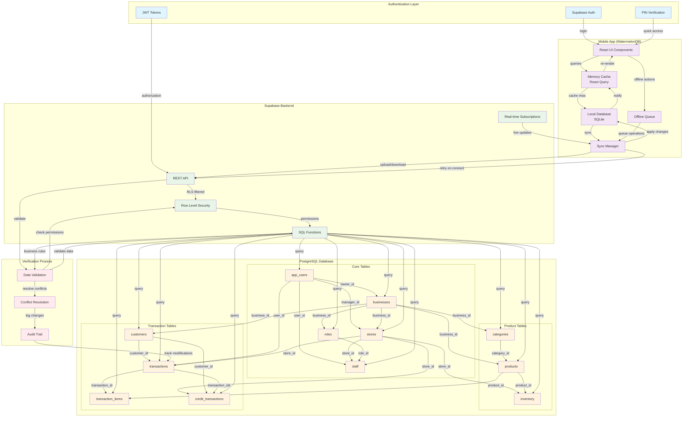
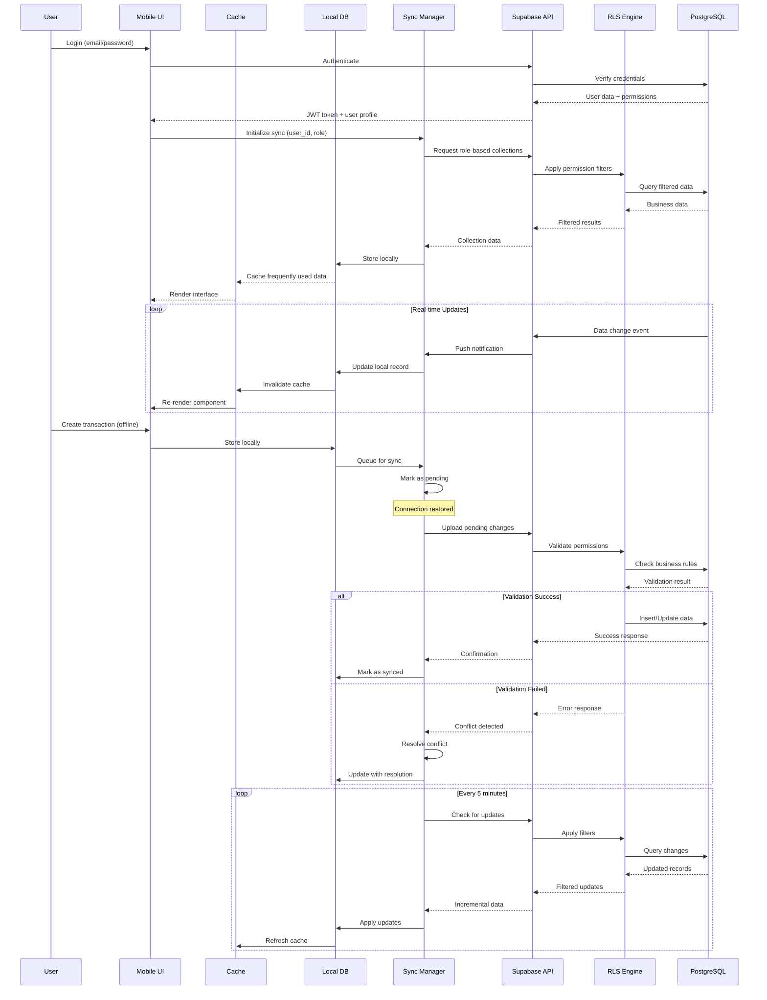
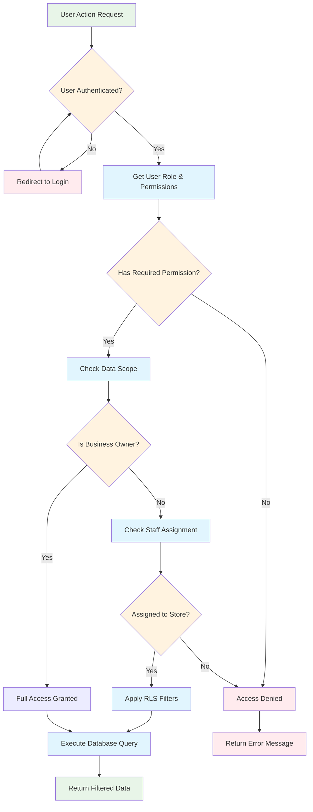
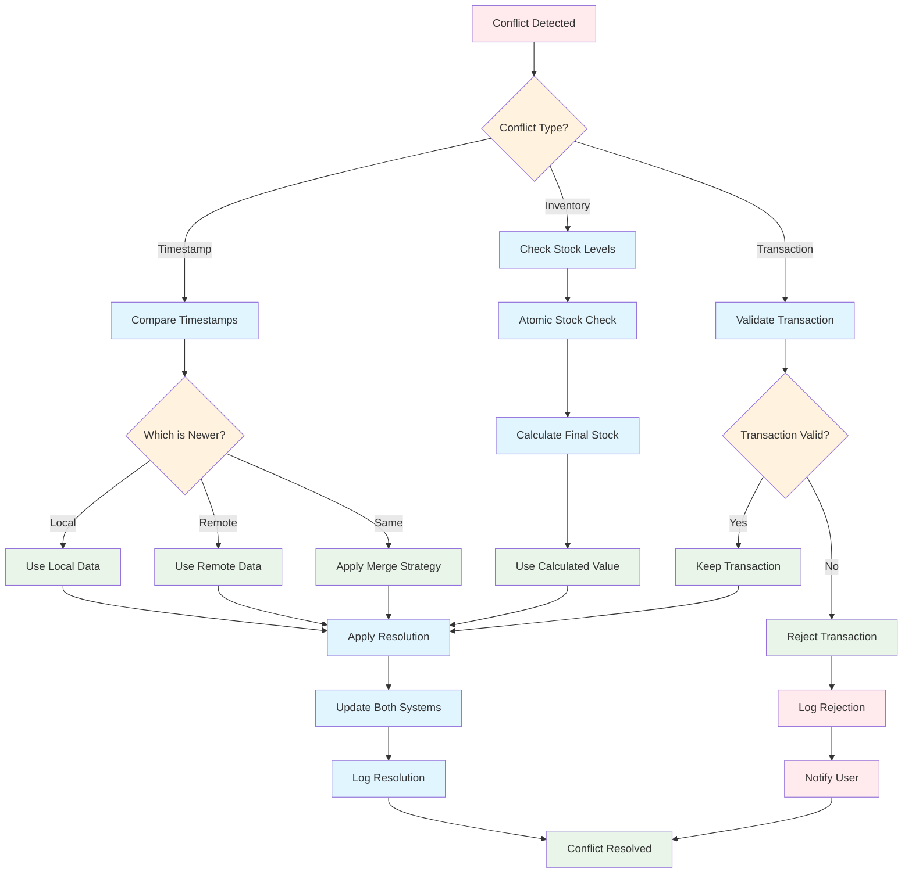

## System Architecture Diagrams

### Data Flow and Relationships Diagram



### Data Synchronization Flow Diagram



### Permission Verification Flow



### Data Conflict Resolution Process



### Cache Hierarchy and Data Flow

```mermaid
graph TB
    subgraph "Client Side"
        subgraph "UI Layer"
            COMP[React Components]
            HOOKS[Custom Hooks]
        end
        
        subgraph "Cache Layer"
            RQ[React Query Cache]
            MEM[Memory Cache]
        end
        
        subgraph "Storage Layer"
            WM[WatermelonDB]
            SQL[SQLite Storage]
        end
    end
    
    subgraph "Server Side"
        subgraph "API Layer"
            REST[REST API]
            RT[Real-time API]
        end
        
        subgraph "Security Layer"
            RLS[Row Level Security]
            AUTH[Authentication]
        end
        
        subgraph "Database Layer"
            PG[PostgreSQL]
            IDX[Indexes]
        end
    end

    %% Data Flow Arrows
    COMP -->|queries| HOOKS
    HOOKS -->|cache check| RQ
    RQ -->|cache hit| COMP
    RQ -->|cache miss| WM
    WM -->|query| SQL
    SQL -->|data| WM
    WM -->|result| RQ
    RQ -->|cached data| COMP

    %% Sync Flow
    WM -->|sync| REST
    REST -->|authenticate| AUTH
    AUTH -->|authorize| RLS
    RLS -->|filter| PG
    PG -->|query| IDX
    IDX -->|results| PG
    PG -->|filtered data| RLS
    RLS -->|authorized data| REST
    REST -->|sync data| WM

    %% Real-time Flow
    RT -->|live updates| WM
    WM -->|notify| RQ
    RQ -->|invalidate| COMP

    %% Cache Invalidation
    MEM -->|timeout| RQ
    RQ -->|stale data| WM
    WM -->|fresh data| RQ

    %% Styling
    classDef uiClass fill:#e8f5e8
    classDef cacheClass fill:#e1f5fe
    classDef storageClass fill:#f3e5f5
    classDef apiClass fill:#fff3e0
    classDef securityClass fill:#ffebee
    classDef dbClass fill:#e0f2f1

    class COMP,HOOKS uiClass
    class RQ,MEM cacheClass
    class WM,SQL storageClass
    class REST,RT apiClass
    class RLS,AUTH securityClass
    class PG,IDX dbClass
